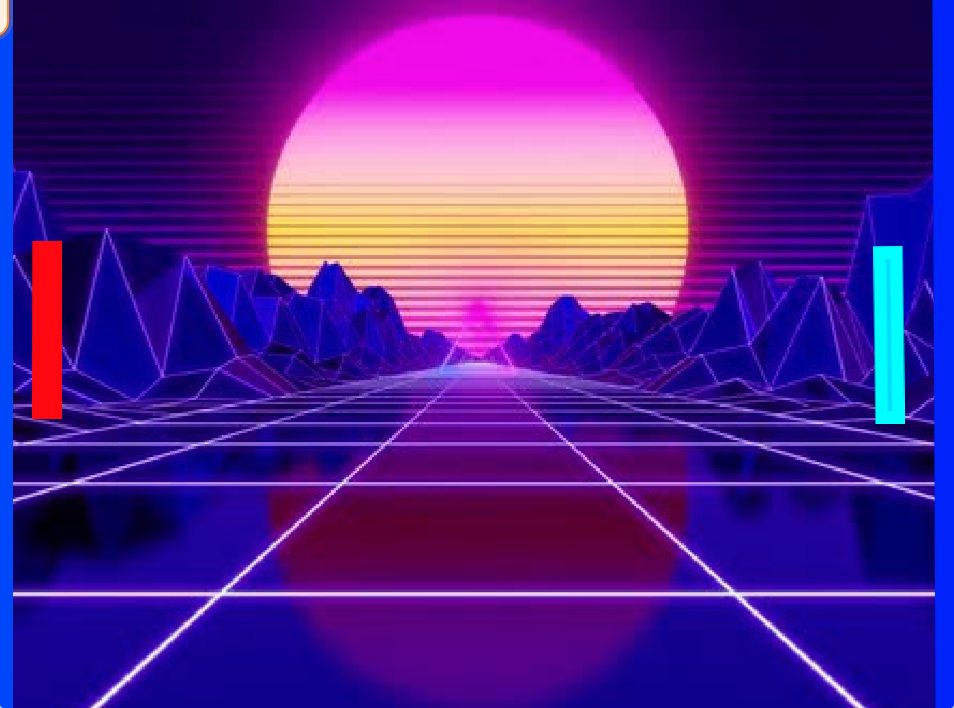

# Elementos de la Jugabiidad: Pong

## Atmosfera 

### background
#### el background ayuda a crear un escenario y va atras del juego
#### mi background es un sunset paper wave tiene lineas trazadas y de coleres azul,violet y rosita. tambien se puede ver montañas

### sonido
#### el sonido hace que el jugador/es sienta emocion al jugar el juego 
#### El sonido en mi juego es un hip hop jazz type beat que crea felicidad y crea buena atmosfera al jugar el juego 

### Graficos
#### los graficos son como se ve el juego ,como se ve el background, los personajes . tambien de que punto de vista se ve el juego como first person third etc... 
#### mis graficos son 2d,tiene 2 paddles rojo y azul, 2 lineas azules y una bola de playa tambien un background paperwave

## Objetos
### son elementos que el jugador puede escoger y lo que hace que el juego tenga un reto
### mis objetos son 2 paddle ,una bola de playa y 2 scores

## mecanica 
### las mecanicas son las acciones en un juego. como brincar, agacharse y moverse
### mis mecanicas estan hechas por una bola que choca contra los paddles pero si le da a la linea azul te suma un punto .

## Personajes 
### son personas u objetos ficticios que nosotros controlamos en el juego
### mis personajes son el paddle zul y el paddle rojo.

## Objetivos 
### los objetivos son metas en un juego para poder completar el juego ,como ganar.
### en mi juego de pong el objetivo es llegar a 5 puntos 

## Controles 
### los controles son los botones que le das para que los personajes se mueva y para que empieze el juego.
### mis controles son las teclas w y s para moverse de arriba a abajo para el primer jugador.Para el segundo jugador usas las teclas de la flechita de arriba y de abajo para moverse de arriba a abajo.

## Dificultad
#### la dificultad de un juego es cuan complicado o facil es un juego para ganar.
### La dificultad de mi juego es facil porque los paddles se mueven rapidos y no es dificil darle a la bola.

## Mundo
### el mundo es lo que rodea los personajes y donde el juego esta pasando.
### el mundo de mi juego son unas montañas de paperwave.

     
   
